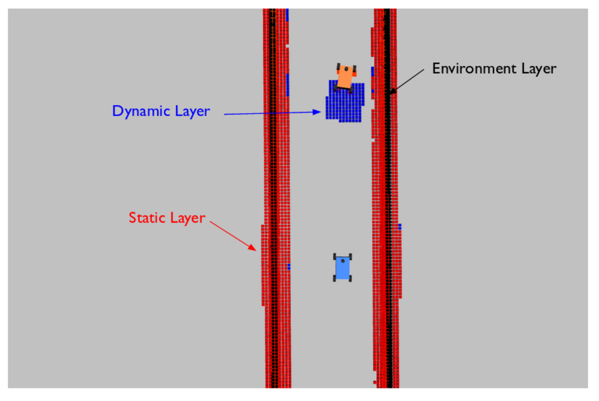
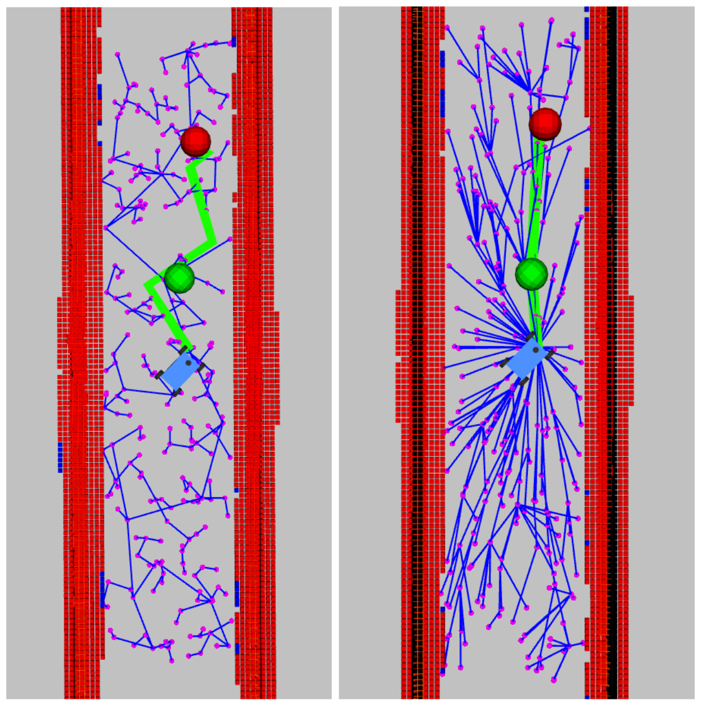

# Lab 4: Pure Pursuit and Motion Planning

This lab combines contains two separate packages to be implemented. In **Part A** you implement Pure Pursuit to make the car follow a fixed set of waypoints. In **Part B** you build a sampling based motion planner (RRT) that generates paths in real time to avoid obstacles, and you use your Pure Pursuit controller from Part A to execute those paths. **Part C** is optional extra credit for RRT*.

The two parts share the same localization stack and the same maps, both of which are provided to you for hardware testing.

This assignment requires considerable effort, and it is recommended to get started early.

## I. Learning Goals

**Part A: Pure Pursuit**

- The Pure Pursuit algorithm
- Waypoint generation and visualization
- Using localization inside the control loop of the car

**Part B: Motion Planning**

- Motion planning basic concepts
  * Configuration space vs. workspace: understand the difference between the two and the advantages and disadvantages of planning in each.
  * Free space vs. obstacle space.
  * Occupancy grids and costmaps: what they are, how to use them, and how to build one.
- Motion planning algorithms
  * Sampling based algorithms: RRT and its variants.

## II. Provided Modules (used by both parts)

Maps and localization code are **provided to you** for hardware testing. While running your code on the hardware, have the localization code runnning so you get pose estimates of the car within the map (see `particle_filter` and associated README).

- **Map of the AIMS lockers area**: `particle_filter/maps/aims.pgm` and `particle_filter/maps/aims.yaml`.
- **Particle filter localization** (`particle_filter/`), already configured to localize against that map. Launch it with:

  ```bash
  ros2 launch particle_filter localize_launch.py
  ```

  This also brings up a map server, so `/map` is published for RViz.

Read `particle_filter/README.md` for setup and for how to initialize the filter with the **2D Pose Estimate** tool in RViz. The only thing you need from it in your own code is this topic:

| Topic | Type | Frame |
| --- | --- | --- |
| `/pf/viz/inferred_pose` | `geometry_msgs/PoseStamped` | `map` |

## III. Simulation vs. the Car

You will run your nodes in two places, and the main thing that changes between them is **where the pose comes from**.

| | Map | Pose source | Message type |
| --- | --- | --- | --- |
| Simulation | `levine`  | `/ego_racecar/odom` (ground truth) | `nav_msgs/Odometry` |
| Physical car | `aims` | `/pf/viz/inferred_pose` (particle filter) | `geometry_msgs/PoseStamped` |

Write your nodes so this swap is easy.

---

# Part A: Pure Pursuit

## A.1 Implementation

We have provided a skeleton for the pure pursuit node in `pure_pursuit/`, in both C++ (`src/pure_pursuit_node.cpp`) and Python (`scripts/pure_pursuit_node.py`). Pick one. As per usual, test your algorithm in the simulator before you test it on the car.

The steps in your pose callback are:

1. Find the current waypoint to track: the point on your waypoint list roughly one lookahead distance `L` ahead of the car.
2. Transform that goal point into the vehicle frame of reference.
3. Calculate the curvature of the arc to that point, and from it the steering angle.
4. Publish an `AckermannDriveStamped`, **clamping the steering angle** to the car's limits.

As shown in class, the curvature of the arc to track can be calculated as:

$$\gamma=\frac{2|y|}{L^2}$$

where $y$ is the lateral offset of the goal point **in the vehicle frame**.

Tune your lookahead distance `L` and your speed.

## A.2 Logging Waypoints

There are several methods you can use to create waypoints for a specific map.

1. Recording a trajectory of a driven path. A starter logger is provided at `pure_pursuit/scripts/waypoint_logger.py`. It subscribes to the car's odometry and saves an `(x, y)` waypoint to a CSV file every time the car moves a set distance. Drive the car around your track, then use that CSV for your Pure Pursuit node. Run it with:

   ```bash
   ros2 run pure_pursuit waypoint_logger.py
   ros2 run pure_pursuit waypoint_logger.py --ros-args -p output_file:=waypoints.csv -p min_distance:=0.1
   ```

   You will need to adapt this logger for recording waypoints on the actual hardware.
2. Find key points in the map (for example the corners of one of the AI Makerspace aisles) and create an interpolated spline that goes through all the corners. You can use functions such as `scipy.interpolate.splprep` and `scipy.interpolate.splev`. You can find more documentation on these [here](https://docs.scipy.org/doc/scipy/reference/generated/scipy.interpolate.splprep.html) and [here](https://docs.scipy.org/doc/scipy/reference/generated/scipy.interpolate.splev.html#scipy.interpolate.splev).

Usually you will just save the waypoints as `.csv` files with columns such as `[x, y, theta, velocity, arc_length, curvature]`. With pure pursuit, the bare minimum is the `[x, y]` positions of the waypoints. Another trick is that you can also smooth the waypoints if you decide to record them with the car. You can subsample the points you gathered and re-interpolate them with the `scipy` functions mentioned above to find better waypoints.

Your waypoints must be in the `map` frame, the same frame the particle filter reports poses in.

## A.3 Visualizing Waypoints

To visualize the list of waypoints you have, and to visualize the current waypoint you are picking, you will need to use the `visualization_msgs` messages and RViz. You can find some information [here](http://wiki.ros.org/rviz/DisplayTypes/Marker).

You must visualize **both** the entire set of waypoints and the single waypoint the car is currently tracking. Seeing the tracked point jump along the path is the fastest way to debug your waypoint selection.

---

# Part B: Motion Planning (RRT)

## B.1 Overview

The goal of this part is to provide you with tools that will help you in a head to head race on a race track. After finishing this part, your car should be able to do something like [this](https://www.youtube.com/watch?v=llHCRqwIllM).

Before you start, you should read this [paper](https://arxiv.org/pdf/1105.1186.pdf). Pay close attention to sections 3.1, 3.2, Algorithm 3, 3.3, Algorithm 6.

### RRT Pseudocode


The pseudocode of the basic version of RRT is listed above. You can find all the details of the functions used by RRT in the paper. If you are implementing RRT*, or another version of RRT, read the RRT* section of the provided paper, and do some research to figure out how to modify the basic version of RRT.

### F1TENTH RRT vs. Generic RRT

In general, RRT is often used as a global planner where the tree is kept throughout the time steps. Whenever there is a new obstacle, and the occupancy grid changes, the tree changes accordingly. In our case, RRT is used as a local planner for obstacle avoidance. This is because we do not have a well defined starting point and goal point when we are racing on a track and we want to run continuous laps. In our implementation, we are only keeping a tree for the current time step in an area around the car. You could try to keep one tree that populates the map throughout the time steps, but speed is going to be an issue if you do not optimize how you are finding nodes and traversing the tree.

## B.2 Coding Assignment

You can choose to implement RRT in either the workspace or the configuration space. Since we are working with a car-like robot, the workspace will be the car's position in the world, and the configuration space will be whatever you decide to add on top of that (heading angle, velocity, etc.).

### Goal Selection and Planning

Your global route for this implementation is the same waypoint list you recorded in Part A. Each timestep you pick a goal point a short distance ahead on that waypoint list, and that goal is what RRT plans toward. When the direct path to the goal is clear, you do not need to run RRT sampling at all, just follow the waypoints with pure pursuit. When an obstacle blocks that direct path, use RRT to plan a path around it, then follow this modified path using pure pursuit.

Implement this logic within your code, i.e. load the waypoint CSV, select the goal point ahead of the car, and decide when to run RRT.

### Implementing an Occupancy Grid

You will need to implement an occupancy grid for collision checking. Think about what is available to you (the map, the LaserScan messages, etc.), and construct an occupancy grid using that information. You can choose to either implement a binary occupancy grid (a grid cell is either 0 for unoccupied, or 1 for occupied), or use a probabilistic occupancy grid (a grid cell has values between 0 and 1 for the probability that it is occupied). You could choose to implement an occupancy grid in the car's local frame (our recommendation), or in the map's global frame. Depending on the size of the map that you use, think about how to compute updates to the occupancy grid and how to store and use the occupancy grid efficiently. Since we are using RRT as a local planner, meaning it comes up with a new path at every time step, you need to run everything relatively fast. You will also want to visualize the occupancy grid to ensure its correctness. You do not have to implement a multi-layer one like the one shown in the figure.



### Working in the Simulator and on the Car

By this point you should be comfortable using the simulator to test your code. The ground truth pose of the car is available in the simulator, which is useful for testing your algorithm there. For the sim map, use the `levine` or `levine_obs` map from the previous assignment. Finally, when you testing on the real car, use the `aims` map. Make sure you start slow and increase your speed gradually.

### Trajectory Execution

After you have found a path to your goal with RRT, there are different algorithms you could use to follow that trajectory. The most obvious solution is the Pure Pursuit controller you built in Part A. Picking the waypoint out of the path for pure pursuit is the most important part for this. You want a balance between having the car steer smoothly and, at the same time, be reactive enough to avoid obstacles. Up-sampling the path for pure pursuit to pick out a waypoint is a good way to go.

### Hints

Think about how you could change the way you are sampling the free space to speed up the process of finding a path to the goal. Also think about how to restrict the area in which you are sampling to make sure you do not have too big a tree. Besides RRT*, there are other versions of RRT that take into account other variables (the dynamics of the car, for example). After you are done with the basic version of RRT, you should do some research and implement a better version.

Make sure you visualize the tree you have expanded, and the path you have chosen as the trajectory.

## B.3 Part C: RRT* (Extra Credit)



You will be rewarded extra credit for implementing RRT*, or another modified version of RRT (if you do something other than RRT*, make a good argument for why it deserves extra credit in `SUBMSSION.md`). On top of the basic version of RRT, RRT* uses a cost function, and rewires the tree to find a better path to the goal. When the tree has expanded an infinite number of nodes, RRT*'s solution is close to optimal. Figure 3 shows the difference in the tree expanded and path found between RRT and RRT*. The skeleton code provided has sections for RRT* functions as well.

---

# V. Deliverables and Submission

You need to submit **one zip file to Canvas** and **four YouTube video links**, in `SUBMISSION.md`. The code deliverables are indivdual; the two hardware videos are per team. Upload each video to YouTube (unlisted is fine) and paste the links into `SUBMISSION.md`.

**1. Zip file, named `lab4_<your_andrew_id>_<your_team_number>.zip`**, submitted to Canvas. Contains both of your completed packages and `SUBMISSION.md`:

```
lab4_<andrew_id>_<team>.zip
├── pure_pursuit/          # your completed Part A package
│   └── waypoints/         # all waypoint .csv files you used (sim and hardware)
├── motion_planning/       # your completed Part B package
└── SUBMISSION.md          # the video links
```

Include **all the waypoint `.csv` files you used** (both the ones for simulation and the physical car) inside your `pure_pursuit` package, in the `waypoints/` folder.

**2. Four video links in `SUBMISSION.md`:**

| Video | What it shows |
| --- | --- |
| **A1 - Pure Pursuit in sim** | Your Pure Pursuit completing a full lap of a track (Levine, Tepper, etc.), with **both** the full waypoint set and the currently tracked waypoint visualized in RViz. |
| **A3 - Pure Pursuit on hardware (team)** | The real car following waypoints in the locker area near AIMS, using the PF code provided, shown alongside RViz with the map and your waypoint markers visible. |
| **B2 - RRT in sim** | Your RRT running in sim with **at least one obstacle** (can just be a static obstable in the way of your global path), showing obstacle avoidance and a visualization of the planned paths and the goal point at each timestep. |
| **B3 - RRT on hardware (team)** | The car running RRT in the locker area with **at least one obstacle**, demonstrating obstacle avoidance. |

# VI. Grading Rubric

## Part A: Pure Pursuit (40 points)

- Compilation: **5** points
- Implemented Pure Pursuit and completes a full lap in sim: **15** points
- Waypoint visualization in RViz (full set + currently tracked point): **3** points
- Submitted waypoint file used on the car: **2** points
- Video on physical hardware (team): **15** points

Deductions:

- Submitted pure pursuit in sim but did not visualize waypoints: **-2** points
- Has video of physical car running pure pursuit but no accompanying RViz: **-2** points
- Pure pursuit code runs in sim but is not able to complete a lap (for example crashes into wall): **-5** points

## Part B: Motion Planning (40 points)

- Compilation: **5** points
- Shows the car going along a straight path in sim: **5** points
- Shows the car replanning around an obstacle in sim: **10** points
- Video on hardware (team): **20** points

Deductions:

- Has RRT running in sim with no waypoint/path visualizations: **-2** points for each one missing
- Submitted sim video of RRT with no evidence of obstacle avoidance: **-5** points
- Submitted physical video of RRT with no evidence of obstacle avoidance: **-5** points
- RRT runs in sim but crashes into obstacle: **-10** points

## Part C: RRT* (Extra Credit)

- Correct RRT* implementation (or a justified RRT variant): **+5 points**
