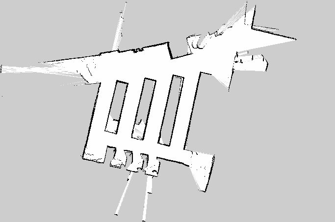

# Particle Filter Localization (no implementation needed)

This package is **provided for you**. You do not need to modify anything in here.

It implements Monte Carlo Localization (MCL) for the F1TENTH car. It localizes the car against the pre-built map of the locker area outisde AI Makerspace and publishes the car's estimated pose, which is an input to your Pure Pursuit node.

## Interface

The interfaces between this package and your code:

| Direction | Topic | Type |
| --- | --- | --- |
| subscribes | `/scan` | `sensor_msgs/LaserScan` |
| subscribes | `/odom` | `nav_msgs/Odometry` |
| **publishes** | **`/pf/viz/inferred_pose`** | **`geometry_msgs/PoseStamped`** |
| publishes | `/pf/viz/particles` | `geometry_msgs/PoseArray` |
| publishes | `/pf/pose/odom` | `nav_msgs/Odometry` |
| broadcasts | `map` -> `laser` | TF |

**`/pf/viz/inferred_pose` is the topic your Pure Pursuit node subscribes to on the car.** Its poses are in the `map` frame (the same frame you must log your waypoints in).

## Running it

```bash
ros2 launch particle_filter localize_launch.py
```

Then:

1. In RViz, set the Fixed Frame to `map` and add a `Map` display on `/map`. An RViz config is included at `rviz/pf.rviz`.
2. Add a `PoseArray` display on `/pf/viz/particles` to watch the particle cloud.
3. Use the **2D Pose Estimate** tool in the RViz toolbar to tell the filter roughly where the car is. The filter cannot converge until you do this.
4. Drive slowly with the joystick and confirm the laser scan lines up with the map walls, and that the particle cloud tightens around the car.

Only start Pure Pursuit once the pose estimate is stable.

## Configuration

Config parameters in `config/localize.yaml`.

- `map` (under `map_server`) — which map in `maps/` to localize against. Set to `aims` while testing on hardware.
- `odometry_topic` / `scan_topic` — set to `/odom` and `/scan`.
- `max_particles`: 3000. Lower it if the filter can't keep up on your hardware.

## Dependencies

RangeLibc is not on apt and must be built:

```bash
sudo pip install cython
git clone http://github.com/kctess5/range_libc
cd range_libc/pywrappers
./compile_with_cuda.sh    # on the car (Jetson Orin) - needed for rmgpu
```

`compile_with_cuda.sh` needs `nvcc` on your `PATH`; on the Jetson that is `/usr/local/cuda/bin`, so you may need:

```bash
export PATH=/usr/local/cuda/bin:$PATH
```

The rest (`nav2_map_server`, `nav2_lifecycle_manager`, `tf_transformations`) come from rosdep:

```bash
rosdep install --from-paths src --ignore-src -r -y
```

## Maps

- `maps/aims.*`: **This is the map for the physical car.**
- `maps/levine.*`:  Levine Hall, included for reference.

The `aims` map was built using the `slam_toolbox` on space outside AIMS (the lockers). The white area is free space, black is occupied (walls), and the surrounding grey is unmapped or "unknown" space.



Do not use `aims` as your *simulator* map. Use the previously used `levine` map for your sim work (see the main lab README).

## Credit

Original implementation by Corey Walsh et al., ROS 2 port by Hongrui Zheng (f1tenth). A mathematical derivation of MCL is in the original lab guide.
